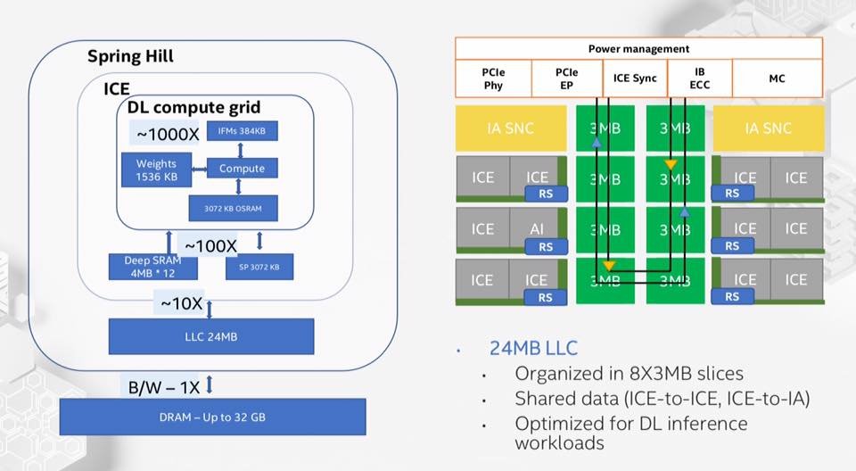
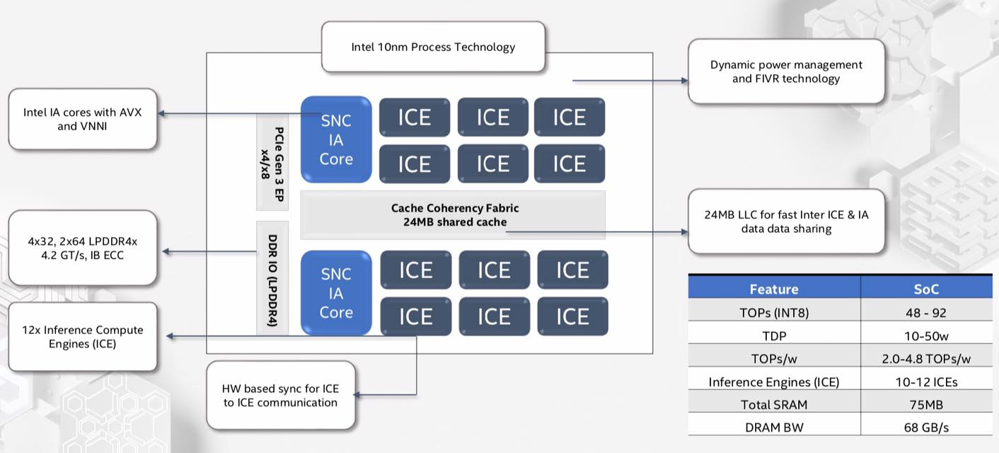

# -Intel-First-Artificial-Intelligence-Chip-Based-on-a-10-Nanometer-Ice-Lake-Processor-

Here comes Springhill, #Intel first Artificial Intelligence chip based on a 10 nanometer Ice Lake processor that will allow high workloads using minimal amounts of energy.‬

‪AI-powered processors will drive the future of AI everywhere.‬

‪Read more at https://newsroom.intel.com/…/Intel-Nervana-NNP-I-HotChips-p…
